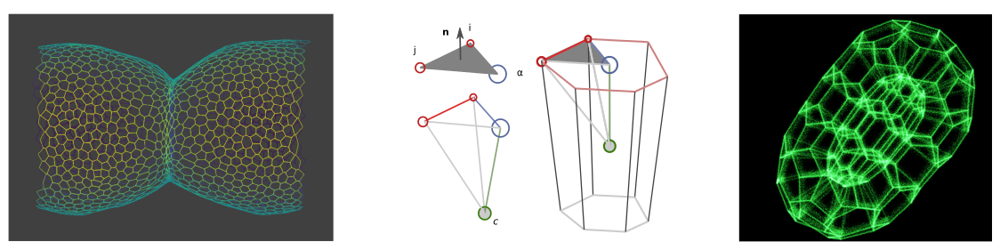
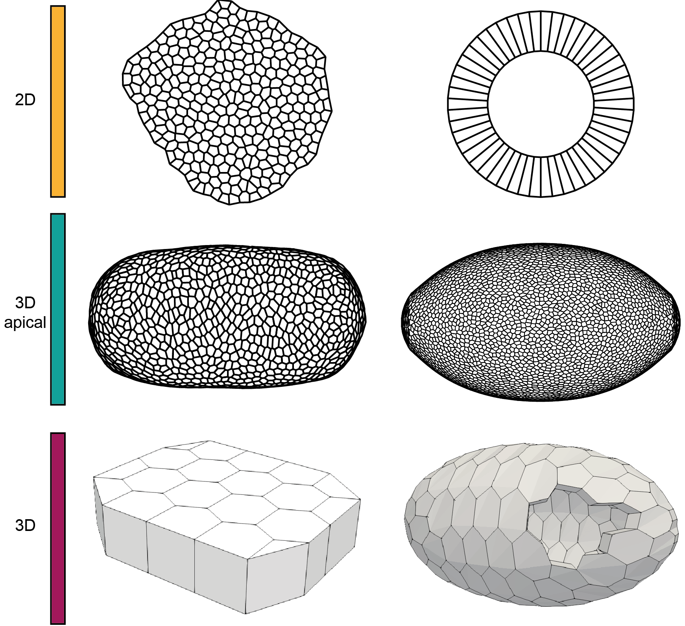
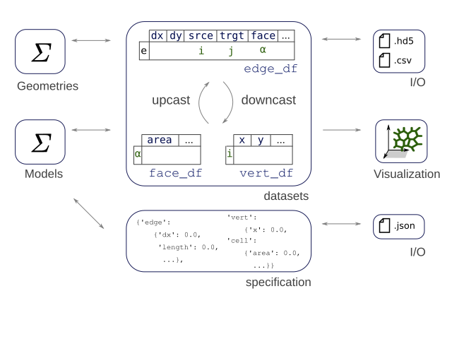

# tyssue : An epithelium simulation library


## [ANN] Working on a 1.0 release

Dear tyssue user or prospective user, I come with good bearings.

This commit to the **new default branch `main` is the official start of the 1.0 release. It is long overdue and there is a lot of house keeping.

### Short term

- [ ] fix CI w/ github actions
- [ ] Readthedocs with mkdoc
- [ ] Tests
- [ ] Notebook tests
- [ ] Merge PRs #263 #274
- [ ] Tests
- [ ] Check Polarization notebooks




<hr/>

<<<<<<< HEAD
=======

[](http://tyssue.readthedocs.io/en/latest/
)

[](https://zenodo.org/badge/latestdoi/32533164) [](https://gitter.im/DamCB/tyssue?utm_source=badge&utm_medium=badge&utm_campaign=pr-badge&utm_content=badge)


>>>>>>> main
| Name | Downloads | Version | Platforms |
| --- | --- | --- | --- |
| [](https://anaconda.org/conda-forge/tyssue) | [](https://anaconda.org/conda-forge/tyssue) | [](https://anaconda.org/conda-forge/tyssue) | [](https://anaconda.org/conda-forge/tyssue) |

| Coverage | Doc | CHAT |
| --- | --- | --- |
| [](https://coveralls.io/r/DamCB/tyssue) | [](http://tyssue.readthedocs.io/en/latest/) |  [](https://gitter.im/DamCB/tyssue?utm_source=badge&utm_medium=badge&utm_campaign=pr-badge&utm_content=badge) |


# tyssue is now published in the Journal of Open Source Software!

| ZENODO DOI | JOSS DOI | 
| --- | --- |
| [](https://zenodo.org/badge/latestdoi/32533164) | [](https://doi.org/10.21105/joss.02973) |

The `tyssue` library seeks to provide a unified interface to implement
biomechanical models of living tissues.
It's main focus is on **vertex based epithelium models**.

## Overview

### What kind of Models does it implement?

The first model implemented is the one described in
Monier et al.<sup id="a1">[1](#f1)</sup>. It is an example of a vertex model,
where the interactions are only evaluated on the apical surface sheet
of the epithelium. The second class of models is still at a
stage. They implement a description of the tissue's rheology, within a
dissipation function formalism.


### What kind of geometry does it model ?
`tyssue` allows to model different geometries in 2D and in 3D.  Presentation of the different geometries and how to create them are shown in this [notebook](https://github.com/DamCB/tyssue-demo/blob/master/01-Geometry.ipynb). 
<p align="center">
 
</p>


### General Structure of the modeling API

#### Design principles

> [APIs not apps](https://opensource.com/education/15/9/apis-not-apps)

Each biological question, be it in morphogenesis or cancer studies is
unique, and requires tweeking of the models developed by the
physicists. Most of the modelling software follow an architecture
based on a core C++ engine with a combinaison of markup or scripting
capacities to run specific simulation.

In `tyssue`, we rather try to expose an API that simplifies the
building of tissue models and running simulations, while keeping the
possibilities as open as possible.

> Separate structure, geometry and models

We seek to have a design as modular as possible, to allow the same
epithelium mesh to be fed to different physical models.

> Accessible, easy to use data structures

The core of the tyssue library rests on two structures: a set of
`pandas DataFrame` holding the tissue geometry and associated data,
and nested dictionaries holding the model parameters, variables and
default values.



The API thus defines an `Epithelium` class. An instance of this class
is a container for the datasets and the specifications, and implements
methods to manipulate indexing of the dataframes to ease calculations.

The mesh structure is heavily inspired by
[CGAL Linear Cell Complexes](http://doc.cgal.org/latest/Linear_cell_complex/index.html),
most importantly, in the case of a 2D vertex sheet for example, each
junction edge between the cells is "splited" between two oriented **half
edges**.


#### Creating an Epithelium

```python
## Core object
from tyssue import Sheet
## Simple 2D geometry
from tyssue import PlanarGeometry
## Visualisation (matplotlib based)
from tyssue.draw import sheet_view

sheet = Sheet.planar_sheet_2d('basic2D', nx=6, ny=7,
                              distx=1, disty=1)
PlanarGeometry.update_all(sheet)
sheet.sanitize()
fig, ax = sheet_view(sheet)
```

### Documentation

* The documentation is now browsable on [tyssue.io](http://tyssue.io)
* The old documentation is still browsable online [here](http://tyssue.readthedocs.io/en/latest/)
* Introduction notebooks are available [here](https://github.com/DamCB/tyssue-demo).

## Visualisation
Thanks to @kephale, there is a napari plugin to visualise tyssue simulation output.  
You can find it [here](https://github.com/kephale/napari-tyssue).


### What's new in 1.0 ? 
* No collision in 2D (use effector `Repulsion`)
* Add new geometry : 2D lateral geometry
* Add mean calculation in `Epithelium`
* Add `sheet` conversion to `mesh` from `Meshio`
* Allow hole in 2D sheet
* Fix some visualisation

### Roadmap
You are welcome to participate in the development of `Tyssue`.  
What is planned for the future of `Tyssue`?
* Solve collision in 2.5D & 3D
* Use ZARR instead of HDF5 as base file format
* Upgrade geometry creation 
  * Compound geometry to form complex shape
  * Use biological image as blueprint
* Add rheology model
* Switch to github-action for continuous integration

### Mailing list:

tyssue@framaliste.org - https://framalistes.org/sympa/info/tyssue

Subscribe ➙ https://framalistes.org/sympa/subscribe/tyssue  
Unsubscribe ➙ https://framalistes.org/sympa/sigrequest/tyssue


### Authors

* Bertrand Caré - @bcare
* Cyprien Gay - @cypriengay
* Guillaume Gay (maintainer) - @glyg
* Hadrien Mary - @hadim
* François Molino
* Magali Suzanne
* Sophie Theis - @sophietheis

## Dependencies

As all the dependencies are already completely supported in
python 3.x, **we won't be maintaining a python 2.x version**, because
it's time to move on...
<details>
  <summary>Show dependencies</summary>
  
### Core

- CGAL > 4.7
- Python >= 3.6
- numpy
- scipy
- matplotlib
- pandas
- pytables
- jupyter
- notebook
- quantities
- ipywidgets
- pythreejs
- ipyvolume
- vispy

### Tests

- pytest
- coverage
- pytest-cov

</details>


## Install

You can install the library with the conda package manager


```bash
conda install -c conda-forge tyssue
```


### Through PyPi

You can also install tyssue from PyPi, this is a CGAL-less version (pure python), lacking some features:

`python -m pip install --user --upgrade tyssue`

### From source

See [INSTALL.md](INSTALL.md) for a step by step install, including the necessary python environment.

## How to cite 
If you find `tyssue` useful please cite [this repository](https://github.com/DamCB/tyssue) using its DOI as follows:

> Theis, Suzanne, Gay, (2021). Tyssue: an epithelium simulation library. Journal of Open Source Software, 6(62), 2973 doi:[https://doi.org/10.21105/joss.02973](https://doi.org/10.21105/joss.02973)
> 
> Zenodo doi:10.5281/zenodo.4817609

## Publications
If `tyssue` has made a substantial contribution to your work, please edit this file and open a PR.

Lou Y, Rupprecht JF, Theis S, Hiraiwa T, and Saunders TE. Curvature-induced cell rearrangements in biological tissues. Phys. Rev. Lett. 2023. doi: [10.1103/PhysRevLett.130.108401](https://doi.org/10.1103/PhysRevLett.130.108401) 

Rahman T, Peters F and Wan LQ. Cell Jamming Regulates Epithelial Chiral Morphogenesis. J Biomech. 2023. doi: [10.1016/j.jbiomech.2023.111435](https://doi.org/10.1016/j.jbiomech.2023.111435)

Fiorentino J and Scialdone A. The role of cell geometry and cell-cell communication in gradient sensing. PLoS Comput Biol. 2022 doi: [10.1371/journal.pcbi.1009552](10.1371/journal.pcbi.1009552)  
Related repository: [https://github.com/ScialdoneLab/2DLEGI](https://github.com/ScialdoneLab/2DLEGI)

Courcoubetis G, Xu C, Nuzhdin SV, Haas S. Avalanches during epithelial tissue growth; Uniform Growth and a drosophila eye disc model, PLoS Comput Biol 2022 doi: [10.1371/journal.pcbi.1009952](https://doi.org/10.1371/journal.pcbi.1009952)

Martin E, Theis S, Gay G, Monier B, Rouvière C, Suzanne M. Arp2/3-dependent mechanical control of morphogenetic robustness in an inherently challenging environment. Dev Cell. 2021 doi: [10.1016/j.devcel.2021.01.005](https://doi.org/10.1016/j.devcel.2021.01.005)  
Related repository: [https://github.com/suzannelab/polarity](https://github.com/suzannelab/polarity) 

Gracia M, Theis S, Proag A, Gay G, Benassayag C, Suzanne M. Mechanical impact of epithelial-mesenchymal transition on epithelial morphogenesis in Drosophila. Nat Commun. 2019 doi: [10.1038/s41467-019-10720-0](https://doi.org/10.1038/s41467-019-10720-0)  
Related repository: [https://github.com/suzannelab/invagination](https://github.com/suzannelab/invagination)

Monier B, Gettings M, Gay G, Mangeat T, Schott S, Guarner A, Suzanne M. Apico-basal forces exerted by apoptotic cells drive epithelium folding. Nature. 2015 doi: [10.1038/nature14152](https://doi.org/10.1038/nature14152)    
Related repository: [https://github.com/glyg/leg-joint](https://github.com/glyg/leg-joint)

## Licence

Since version 0.3, this project is distributed under the terms of the [General Public Licence](https://www.gnu.org/licenses/gpl.html).


Versions 2.4 and earlier were distributed under the [Mozilla Public Licence](https://www.mozilla.org/en-US/MPL/2.0/).

If GPL licencing is too restrictive for your intended usage, please contact the maintainer.

## Research notice
Please note that this repository is participating in a study into sustainability
 of open source projects. Data will be gathered about this repository for
 approximately the next 12 months, starting from June 2021.

Data collected will include number of contributors, number of PRs, time taken to
 close/merge these PRs, and issues closed.

For more information, please visit
[our informational page](https://sustainable-open-science-and-software.github.io/) or download our [participant information sheet](https://sustainable-open-science-and-software.github.io/assets/PIS_sustainable_software.pdf).

<hr/>

<b id="f1">1</b> : Monier B, Gettings M, Gay G, Mangeat T, Schott S, Guarner A, Suzanne M. Apico-basal forces exerted by apoptotic cells drive epithelium folding. Nature. 2015 doi: [10.1038/nature14152](https://doi.org/10.1038/nature14152) [↩](#a1)