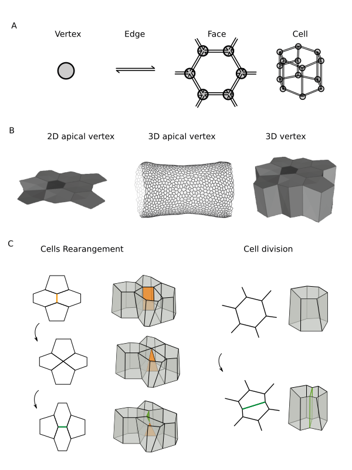
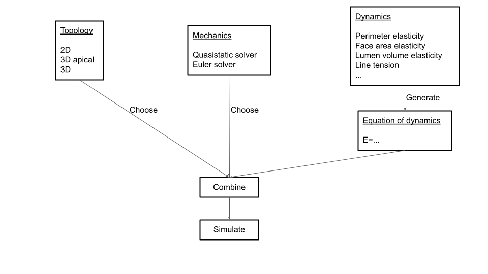

# Summary

The `tyssue` Python library seeks to provide a unified interface to implement bio-mechanical models of living tissues. It's main focus is on vertex based epithelium models. `tyssue` allows to model the mechanical behavior of 2D, apical 3D or full 3D epihelia based on the numerical resolution of the equations of motion for the mesh vertices. Biological process are modeled through changes in the topological and dynamical properties of the mesh. `tyssue` is a modular library. Starting with the same tissue geometry, the choice of constraints, energy potential terms and parameters increases the possibility to answer different biological questions and easily explore mechanical hypotheses.

# Statement of Need

Tissue remodelling is a complex process integrating a large number of input such as gene expression pattern, cell adherent properties, cell mechanics. It can be difficult to manipulate specific aspects genetically. It can even be hard to simply capture, when the process takes only few minutes. Furthermore, morphogenesis is inherently a mechanical process. To execute complex morphogenetic movements, epithelia are driven by in-plane forces, like constriction of apical cell surface [@Heer:2017], and/or out-plane forces, such as the apico-basal cable in apoptotic cell [@Monier:2015, @Gracia:2019] or lateral tension [@Sherrard:2010, @Sui:2018]. Modeling those process help us understand how tissue acquires their shape, in complement of the experimental systems, and beyond their limitations. Several vertex models have been developed in the past few years to describe the physics of epithelia (for a review, see [@Alt:2017]), and common features can be identified. Several kind of model have already been published. The apical vertex model has been used several time to study topology change during morphogenetic movement in _Drosophila, Hydra and Xenopus_([@Staple:2010], [@Farhadifar:2007], [@Aegerter:2012]). Associated with protein dynamics, it has been used to study the effect of protein position on tissue organisation in zebrafish retina ([@Salbreux:2012]). 
3D vertex model have been used to study epithelium deformation due to normal development or to cancer development ([@Okuda:2015], [@Eritano:2020]).
Most of the time, models are developed for a specific biological question and are difficult to adapt to an other system, for severals reasons. With `tyssue` library, we propose models which are adaptable and scalable with the fied research and the biological question. Topology and mechanics are implement independantly to improve the versatility of models.

The `tyssue` library defines tissue as meshes. A vertex model defines a tissue as an assembly of vertices and edges, which can form polygonal face (in 2D) or polyhedron (in 3D). For now, we assume that cell junction are straight lines. In `tyssue`, each edge is split, so that every face is limited by oriented "half-edges" (see figure 1 A), in a structure identical to the [Linear Cell Complex](https://doc.cgal.org/latest/Linear_cell_complex/index.html) in the CGAL library. The `tyssue` library  allows to produce different kind of tissue, from 2D to 3D tissue (see figure 1 B). The library implements concepts and mechanisms common to all vertex models, for both topological and mechanical aspects. 

**Figure 1: Description of tyssue geometry.** _A-Composition of a tissue from a vertex to a cell. B-Three kind of geometry that can be used in tyssue. C-Example of cell dynamics usable in 2D and 3D._

### Topology

Common cellular process are implemented in our library such as cell elimination, division or rearangements. We implemented those processes based on previous works.

Cell division is modeled as the splitting of a cell by a straight line (or plane in 3D) [@Brodland:2002], the angle and position of the division plane can be decided (see Figure 1 C, right pannel).

Changes in cell neighbours - also called rearangements - happen when the size of the boundary between two neighboring cells passes below a certain threshold length in 2D (type 1 transition), or area in 3D (I-H or H-I transition)  [@Okuda:2015]. In that case, the linked vertices fuse and are separated again, witch can lead to a change in the local topology  (see Figure 1 C, left pannel).

Cell elimination happens when a cell area (volume) reaches a low threshold. When this happens, cell starts to loose contact with neighboring cells through series of rearangements. Once the cell is reduced to a triangle (in 2D) or a tetrahedron (in 3D) the remaining vertices are merged to create a new vertex.

Although it was customary to assume the neighbor exchange to be a single step process, we follow the work by Finegan et al. which describes cell exchange as a multistep, stochastic process [@Finegan:2019]. As a consequence, in `tyssue`, vertices are not limited to 3 (in 2D) or 4 (in 3D) linked edges, but can form "rosettes" - see [type1](https://github.com/DamCB/tyssue-demo/blob/master/06-Type_1_transition.ipynb) and [rosette](https://github.com/DamCB/tyssue-demo/blob/master/08-Rosettes.ipynb) examples.

### Mechanics

In `tyssue`, the dynamical behavior of an epithelium is described by solving the equation of motions following Newton's principle. At the scales of the studied processes, the inertia is negligible compared to other forces such as friction, adhesion or contraction of the actin cytoskeleton.

Honda et al. assume that cell movements respond to mechanical forces in an overdamped manner and the vertices are driven by the sum of interfacial tension on cell boundaries and the resistance force against the deformation of cells ([@Honda:1978], [@Honda:1983]). The `EulerSolver` class in `tyssue` allows to simulate such an overdamped movement.

Interactions in the epithelium are described as potentials depending on the mesh geometry, as described in Farhadifar et al., who showed that a 2D epithelium geometry and topology can be faithfully repoduced by finding the quasi-static equilibrium of an energy depending on cell areas and junction lengths [@Farhadifar:2007]. The `QSSolver` class allows to solve this gradient descent problem.

More recently, Bi et al. focused his work on tissue rigidity which allows or not cell displacement in an epithelium, based on the relation between area and perimeter of a cell [@Bi:2015]. In `tyssue`, it is easy to define custom terms of the potential, through an object oriented model "factory" design, and use them to solve either the overdamped or gradient descent problem.

This way, it is easy to test various combinations of energy terms and find those that best fit the observed _in vivo_ dynamics.

**Figure 2: Organisation of different part of tyssue**

Documentation of the `tyssue` Python library can be found [here](https://tyssue.readthedocs.io/en/latest/). Notebook introduction to how to use `tyssue` library can be found [here](https://github.com/DamCB/tyssue-demo).

The `tyssue` library has already been used in several studies with different context of epithelia morphogenesis, such as leg folding and mesoderm invagination in *Drosophila melanogaster* ([@Monier:2015], [@Gracia:2019], [@Martin:2021]). Github repository from those publications can be found [here](https://github.com/glyg/leg-joint), [here](https://github.com/suzannelab/invagination) and [here](https://github.com/suzannelab/polarity) respectively.

# Acknowledgements

The work of this paper was supported by grants from the European Research Council (ERC) under the European Union Horizon 2020 research and innovation program (grant number EPAF: 648001), and from the Association Nationale de la recherche et de la Technologie (ANRT). `tyssue` has benefited from the contributions of Hadrien Mary (@Hadim), George Courcoubetis (@gcourcou), Bertrand Caré (@bcare) and Félix Quinton (@felixquinton).

We wish to thank Magali Suzanne and her team for their continuous support and for providing valuable insight on epithelium biology, Cyprien Gay for the discussions on the physics of epithelia, and the scientific python community for the core tools we use in this project.

# Correspondence
Please contact guillaume@damcb.com

# Code

tyssue is written in Python 3. Code and detailed installation instructions can be found [here](https://github.com/DamCB/tyssue/blob/master/INSTALL.md). Continuous integration is performed with [Travis](https://travis-ci.org/github/DamCB/tyssue). The associated code coverage can be found at [CodeCov](https://codecov.io/gh/DamCB/tyssue).

# References
